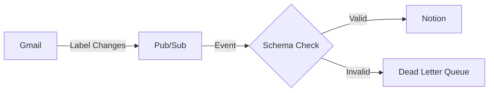

# Gmail-Notion Bridge Core

```mermaid
flowchart LR
    Gmail -->|Label Changes| PubSub[Pub/Sub]
    PubSub -->|Event| Validator{Schema Check}
    Validator -->|Valid| Notion
    Validator -->|Invalid| DLQ[Dead Letter Queue]
```
